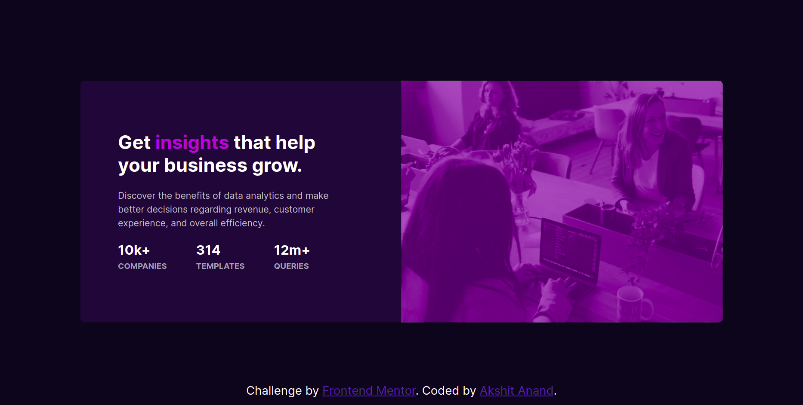
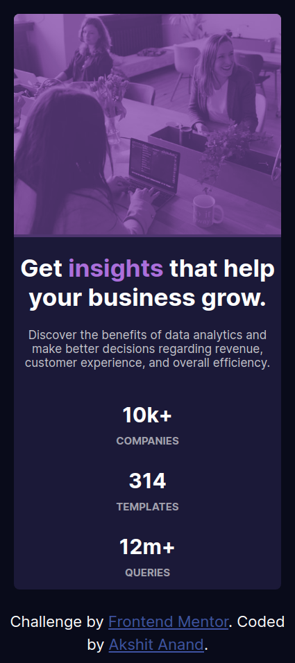

# Frontend Mentor - Stats preview card component solution

This is a solution to the [Stats preview card component challenge on Frontend Mentor](https://www.frontendmentor.io/challenges/stats-preview-card-component-8JqbgoU62). Frontend Mentor challenges help you improve your coding skills by building realistic projects.

## Table of contents

- [Overview](#overview)
  - [The challenge](#the-challenge)
  - [Screenshot](#screenshot)
  - [Links](#links)
- [My process](#my-process)
  - [Built with](#built-with)
  - [What I learned](#what-i-learned)
  - [Useful resources](#useful-resources)
- [Author](#author)

## Overview

### The challenge

Users should be able to:

- View the optimal layout depending on their device's screen size

### Screenshot




### Links

- Solution URL: [Github](https://github.com/akshit-anand/frontend-mentor/tree/main/stats-preview-card-component)

## My process

### Built with

- CSS custom properties and SASS
- FlexBox
- Mobile-first workflow

### What I learned

I learned how to change/reverse two sections position without changing the html with the help of css FlexBox property - **flex-direction: column-reverse**

```css
.card-container {
  display: flex;
  flex-direction: column-reverse;
}
```

### Useful resources

- [CSS-TRICKS FlexBox](https://css-tricks.com/snippets/css/a-guide-to-flexbox/)
- [W3SCHOOLS CSS](https://www.w3schools.com/css/default.asp)

  These resources helped me to learn and understand html and css and helped in to complete the project

## Author

- Frontend Mentor - [@akshit-anand](https://www.frontendmentor.io/profile/akshit-anand)
- Github - [@akshit-anand](https://github.com/akshit-anand)
- Twitter - [@akshit_anand02](https://twitter.com/akshit_anand02)
